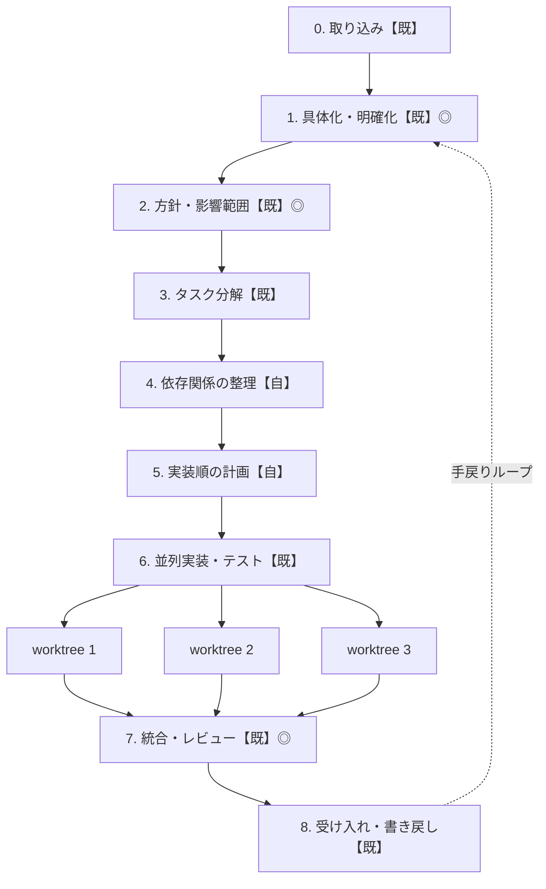

# ユーザーストーリー並列実装パイプライン — Claude Code 構成ガイド

ユーザーストーリー粒度に分解されたチケットを、**Spec Kit（SDD）** と **Claude Code のネイティブ機能（サブエージェント / agent teams / git worktree）** を組み合わせて並列実装するためのリファレンス。

- **前半（仕様 → 計画 → 分解）**: Spec Kit 系 SDD フローでほぼ賄える
- **中央（依存整理 → 実装順計画）**: どの SDD ツールも空白。自作スキルで埋める ← **差別化ポイント**
- **後半（並列実装）**: agent teams + git worktree がネイティブの答え

**工程タグ**: `【既】` 既製ツールで賄う / `【自】` 自作スキルが必要
**チェック記号**: `◎` 必須ゲート / `○` 推奨 / `△` 軽く一瞥

> 本パイプラインが「Steps of AI Adoption」の **Step 2（Parallel）** をどう具体化しているか、および前提となる開発環境は §2 を参照。

---

## 1. パイプライン全体像



> 工程5（実装順の計画）には、wave 単位で人間が確認しながら進める「モードA」と、
> Agent teams のタスク依存に一括委譲する「モードB」の2択がある。詳細は §6。

---

## 2. 本パイプラインの位置づけ — Step 2（Parallel）の具体化

本パイプラインは、Anthropic の Boris Cherny による **「Steps of AI Adoption」**（`0 Gated → 1 Assisted → 2 Parallel → 3 Supervised autonomy → 4 AI-native`）の **Step 2（Parallel）** を、ユーザーストーリー単位で実運用に落とすための具体的な手順書にあたる。

- **Step 1（Assisted）** は「エンジニア1人＋エージェント1体」で同期的に張り付き、全変更を逐一レビューする段階。
- **Step 2（Parallel）** は「1人のエンジニアが **5〜10 体のエージェントをオーケストレーション**する」段階。バックログが「週単位」から「エンジニア1人の午後の作業」に圧縮される。

工程6（並列実装）で agent teams に wave を流す構図は、まさに Step 2 の「1人が複数エージェントを並行制御する」姿そのもの。**1 wave = 同時に走らせる 5〜10 個の PR 粒度タスク** が、記事のいう Step 2 の並列単位に一致する。

### 前提となる開発環境（Step 1 → 2 の移行で整える5項目）

このパイプラインは、以下の環境が整っていることを**暗黙の前提**にしている。逆に言えば、これらが無い状態でいきなり工程6を並列で回すと破綻する（人が全 diff を追えず、Auto mode が無ければ許可待ちで止まり、自己検証が無ければ green の保証が無いままマージに突っ込む）。

| 項目             | 整備内容                                                                                                 | 本書での対応                                                                     |
| ---------------- | -------------------------------------------------------------------------------------------------------- | -------------------------------------------------------------------------------- |
| **実行環境**     | worktree ごとに分離されたチェックアウト、複数セッション同時実行可能な CLI/Desktop 環境                   | 工程6（agent teams が worktree を自動生成）                                      |
| **検証環境**     | test + build + lint + e2e が揃った「本物の」dev 環境。各 teammate がマージ前に自分の作業を自己検証できる | 工程6の Feedback 層（実装→テスト→green→PR）、hooks（PostToolUse=lint/test 強制） |
| **権限設定**     | `settings.json` での安全コマンド事前承認、Auto mode 常時有効化（許可待ちで止まらせない）                 | §7 リポジトリ構成、hooks（PreToolUse=禁止ライブラリ遮断）                        |
| **レビュー体制** | Code Review / Security Review の自動化。人間はキーストロークではなく**最終 diff のみ**をレビュー         | 工程7（多観点レビューを別 teammate に割る）＋ HOTL のマージゲート                |
| **可観測性**     | Agent view / Remote control / Analytics で並行エージェントを監視                                         | 工程6の `/tasks` 監視、§8 の「承認ではなく監視」原則                             |

> **要点**: この5項目のうち最も作り込みが要るのは **検証環境（自己検証ループ）**。「人が全出力を読まなくても、エージェント自身が test/build/lint/security scan を完走してから PR を出す」状態を信頼できるレベルまで作れて初めて、工程6の並列度を安全に上げられる。ここが崩れていると、並列度を上げるほど未検証コードがマージ口に殺到する。

### タスク粒度が PR 単位である理由（Step 2 との整合）

工程3で「PR 1本＝タスク1つ」に縛るのは、Step 2 の並列モデルから逆算した必然。

- **これより粗い**（1エージェント＝1機能全体）と、単独で長時間走りレビュー困難な巨大 diff を生み、「最終 diff だけレビューする」という Step 2 の前提が成立しない。
- **これより細かい**（関数単位など）と、5〜10 体のオーケストレーションに認知負荷が耐えられず（記事のボトルネック＝「プロンプトとステアリングのジャグリング」）、Step 2 というより単なる細切れ発注になる。

PR 粒度が満たすべき具体条件は、本書の工程・自作スキルがそのまま担保する。

| 観点       | 目安                                              | 担保する工程                                       |
| ---------- | ------------------------------------------------- | -------------------------------------------------- |
| 大きさ     | 1 PR 相当（レビュー可能な完結した差分）           | 工程3（`/speckit.tasks`）                          |
| 独立性     | ファイル重複（`touches`）が無いか wave で分離済み | 工程4・5（`dependency-mapper` / `wave-scheduler`） |
| 検証可能性 | 単体で test/build/lint/security scan が完走       | 工程6の Feedback 層                                |
| 依存関係   | `depends_on` が解決済み（先行タスク完了後に着手） | 工程4・5                                           |

つまり記事の抽象的な Step 2 記述を、`dependency-mapper` + `wave-scheduler` の設計で具体的な運用手順に翻訳できている、という整合が取れている。

> **Step 3（Supervised autonomy）への布石**: Step 1→2 で整えた worktree 分離・自己検証・Auto mode・自動レビューはそのまま Step 3 の土台になる。Step 3 では「テストが通るか」に加えて「そもそもこの仕事をエージェントに任せてよいか」を判断する文脈基盤・ポリシー（コンテキスト取得の MCP 連携、プロアクティブ起動の許可範囲など）が新たに要るが、それは本書のスコープ外。

---

## 3. 実行手順 早見表

| 工程                            | 使うコマンド / スキル                                                                                                                                                                                                              | アウトプット                                                                                             | 人のチェック                                                                                                                              |
| ------------------------------- | ---------------------------------------------------------------------------------------------------------------------------------------------------------------------------------------------------------------------------------- | -------------------------------------------------------------------------------------------------------- | ----------------------------------------------------------------------------------------------------------------------------------------- |
| **【既】0. 取り込み**           | Jira MCP、または Spec Kit の Jira 拡張（`specify extension add`）                                                                                                                                                                  | `specs/<story-id>/` に spec の種（生ストーリー＋受け入れ条件ドラフト）                                   | `△` 取り込んだ課題が正しいか一瞥。スコープ違いだけ弾く。基本は自動                                                                        |
| **【既】1. 具体化・明確化**     | `/speckit.specify` → `/speckit.clarify`。対話で曖昧点を潰す                                                                                                                                                                        | `spec.md`（EARS 記法の受け入れ条件つき）                                                                 | `◎` **最重要ゲート**。仕様合意が全並列作業の前提。ここが曖昧だと後段が全部崩れる                                                          |
| **【既】2. 方針・影響範囲**     | `/speckit.plan` ＋ Explore サブエージェントの並列 fan-out（読み取り専用調査）→ `/speckit.checklist`（plan 確定後の要件品質ゲート）                                                                                                 | `plan.md`（技術方針）＋ `impact.md`（影響ファイル/モジュールのマップ）＋ ドメイン別 Acceptance Checklist | `◎` アーキ選択・境界の承認点。over-engineering の是正もここで                                                                             |
| **【既】3. タスク分解**         | `/speckit.tasks`（constitution で PR 粒度を強制）→ `/speckit.analyze`（spec/plan/tasks の整合チェック。実装前の最終ゲート）                                                                                                        | `tasks.md`（各タスク＝PR 1本の粒度）＋ 整合レポート                                                      | `○` 粒度が PR 相当か・抜け漏れが無いか。analyze の指摘があればここで解消してから工程4へ                                                   |
| **【自】4. 依存関係の整理**     | 自作 `dependency-mapper` スキル                                                                                                                                                                                                    | `plan.dag.json`（各タスクに `depends_on` と `touches:[files]`。論理依存＋物理依存）                      | `○` DAG を目視し依存漏れ/過剰を矯正。機械可読なのでレビューは速い                                                                         |
| **【自】5. 実装順の計画**       | 自作 `wave-scheduler` スキル。**モードA**＝「守るべき順番」と「同じファイルを同時に触らないこと」の2条件でタスクを同時実行OKな束(wave)に分割／**モードB**＝ファイル重複を疑似的な依存関係に変換しDAGごと一括登録（用語の意味は§6） | モードA: `waves.md`+`handoff.md`（wave 単位の割り当て表）／モードB: 衝突エッジ合成済み DAG               | `○` **攻め具合の判断点**。並列度とコスト/衝突リスクに加え、モードA/Bどちらで進めるかを承認                                                |
| **【既】6. 並列実装・テスト**   | agent teams + git worktree を起動（各 teammate＝実装→テスト→green→PR）。モードAは wave 単位で手動ハンドオフ、モードBは一括登録して自己組織化に任せる。規模が上がれば headless `claude -p`                                          | wave（またはDAG全体）ごとの PR 群（テスト green・branch 隔離）＋共有タスクリストの進捗                   | `△` モードA: 原則 **wave の切れ目のみ**。モードB: hookによるイベント駆動監視（§8）。実行中は `/tasks` で監視に留め、詰まり/暴走時だけ介入 |
| **【既】7. 統合・レビュー**     | wave 順マージ＋衝突解消。Claude Code 純正の `/code-review`（コード品質観点）・`/security-review`（脆弱性観点）を統合ブランチに対して実行し、それ以外の観点（perf / 受け入れ基準）は別 teammate に割る多観点レビュー                | 統合ブランチ＋レビュー指摘＋チェック済み受け入れリスト                                                   | `◎` **PR マージ承認ゲート**。人が最終ゲートを持つ                                                                                         |
| **【既】8. 受け入れ・書き戻し** | DoD 照合（spec の受け入れ条件 vs 実装）＋ Jira 更新。齟齬が見つかれば spec を修正し該当タスクを再生成（→ 工程1へ手戻り）                                                                                                           | DoD 判定＋Jira ステータス更新＋（必要なら）手戻りチケット/仕様更新                                       | `○` Done 宣言の承認。DoD 未達・手戻り発生時の判断                                                                                         |

---

## 4. 各フェーズの詳細

### 計画フェーズ【既｜既製で賄う】

Spec Kit を `specify init --integration claude --integration-options="--skills"` で導入すると、`/speckit.*` の各コマンドが **`.claude/skills/speckit-*/SKILL.md`**（agent skill 形式）として展開される。Claude Code は commands と skills を統合済みで、`.claude/commands/` は非推奨の互換パス（バージョンによっては認識されなくなる場合がある）になっているため、skills モードでの導入が安全。各フェーズが Markdown 成果物を次段に渡し、各段に人のチェックポイントが入る（Specify → Plan → Tasks → Implement）。`.specify/memory/constitution.md`（技術スタック・テスト必須・スタイルなどの非交渉ルール）を全エージェントが参照する。

- **明確化**: `/specify` → `spec.md`、`/clarify` で曖昧点を対話的に潰す。ここは HOTL の承認点。受け入れ条件は **EARS 記法** でテスト可能な形に落とすと、後段のテスト自動化に効く。
- **方針・影響範囲**: `/plan` → `plan.md`。ここに **Explore サブエージェントの並列 fan-out** を足すのが肝。認証／DB／API モジュールを別々のサブエージェントで同時に調べさせ、結果を統合する。影響範囲調査は **読み取り専用なので並列化が安全**。「どのファイルが変わるか」のマップ（`impact.md`）がこの段で出る。plan 確定後に `/checklist` で「要件の unit test」を回し、ドメイン別（security/UX等）の完全性・明確性を実装前に検証する。
- **タスク分解**: `/tasks` → `tasks.md`。Spec Kit のタスクは feature 内でフェーズ分けされるので、**PR 1本＝タスク1つ** の粒度になるよう constitution かプロンプトで縛る。分解後、実装（工程6）に入る前の最終ゲートとして `/analyze` を回し、spec・plan・tasks 間の矛盾や抜け漏れを検出する。ここで直すのが最も安く、実装後に直すのが最も高くつく。

### 依存・スケジューリングフェーズ【自｜自作スキル】

Spec Kit は仕様のバージョニングも機能間依存の表現も持たない。「この機能は 003 の完了が前提」といった依存を書く仕組みが無い。想定ステップ 4・5 がまさにその穴で、ここが enabling team の作り込みどころ。→ 詳細は「§6 自作スキルの勘所」。

### 実装フェーズ【既｜ネイティブ】

wave 単位で **agent teams** を起動する。各 teammate は独立したコンテキストウィンドウを持ち、調整は直接メッセージではなく **ディスク上の共有タスクリスト（共有ファイル状態）** を介する。各 teammate はタスクを in-progress として確保してから着手し、完了時に成果物を publish するので、後続タスクがそれを参照できる（＝依存 DAG と綺麗に噛み合う）。Claude Code が **worktree を自動生成** してそのディレクトリで作業・コミットし、セッション終了時に片付けるため、並列ブランチの物理隔離もネイティブ。各 teammate 内で「実装 → テスト実行 → green になるまで修正 → PR」を回すのが Feedback 層。

### ラッパー工程【既｜元の6工程に無かった追加分】

- **取り込み**: Jira/課題を repo に spec の種として引き込む。Spec Kit は拡張で Jira 連携・実装後コードレビュー・V-Model のテストトレーサビリティ・PR 作成を追加できる。
- **統合・レビュー**: 並列ブランチは **必ず衝突しうる** ので wave 順マージと衝突解消が要る。レビューは security / performance / test / 受け入れ基準の **多観点を別 teammate に割る** と網羅性が上がる。security 観点と code quality 観点は、Claude Code 純正の `/security-review`（脆弱性スキャン）・`/code-review`（コード品質レビュー、bundled skill）をそのまま統合ブランチに対して走らせれば済むので自作不要。ここも HOTL の承認点。
- **受け入れ・書き戻し**: DoD（spec の受け入れ条件）照合と Jira ステータス更新。実装で spec の誤りが判明したら仕様を直して該当タスクを再生成する **手戻りループ** を明示（矛盾検出そのものは工程3の `/analyze` が実装前に担うので、ここでの役割は実装結果と spec の突き合わせと、手戻り先の判断）。

---

## 5. 並列化モデルの選択（設計の核心）

「並列実装」には 3 つの機構があり、**用途で使い分ける**のが正解。混同すると壊れる。

| 機構                              | 実体                                              | 向く工程                                     | 注意                                                                                                                                                                                                           |
| --------------------------------- | ------------------------------------------------- | -------------------------------------------- | -------------------------------------------------------------------------------------------------------------------------------------------------------------------------------------------------------------- |
| **サブエージェント**              | 1 セッション内で分岐、main に要約を返す           | 方針・影響調査など **読み取り並列**（工程2） | ファイル変更を伴うと orchestrator が書き込みを直列化する。共有ファイルがあると衝突。実装本体には不向き                                                                                                         |
| **agent teams + worktree**        | 複数セッション/独立コンテキスト・共有タスクリスト | **並列実装本体**（工程6）                    | 現状 experimental で本番投入は要検証。トークンは teammate 数に比例、**3〜5 teammate 推奨**。タスク依存は自動アンブロックされるが、完了マーク漏れで下流が永久ブロックされる既知の制限あり（§6 モードB／§8参照） |
| **headless オーケストレーション** | `claude -p` を driver から複数プロセス起動        | スケール／CI 組み込み／役割別モデル指定      | 組み込み調整を失う代わりに完全な制御。role 別モデル（lead=Opus / 実装=Sonnet / テスト=Haiku）は agent teams 未対応のため、こちらの `--model` で回避                                                            |

**推奨する段階的移行**:

1. 影響調査は **Explore サブエージェントの fan-out**
2. 実装本体は **agent teams + worktree** で開始
3. 規模が上がったら **headless driver（Python）** で `worktree × claude -p` を回す

「wave スケジュール → プロセス起動 → PR 収集」の driver に育てられる。

---

## 6. 自作スキルの勘所（差別化ポイント）

既製がないので skill を 2 本作る。ここが後段のマージ地獄を防ぐ「保険」になる。

### `dependency-mapper` スキル（工程4）

`tasks.md` と方針段の `impact.md` を入力に、**機械可読な DAG** を出力する（各タスクに `depends_on` と `touches:[ファイル群]` を付与、または `plan.dag.json`）。依存は 2 種:

- **論理依存**: B が A の成果物（型・API 契約・スキーマ）に依存
- **物理依存**: 同一ファイル/モジュールを触る ＝ **論理的に独立でも衝突リスク**

#### なぜ Agent teams を最大限使っても代替できないか

Agent teams が解決するのは「共有タスクリストを介した"調整"」であって、「どうタスクを切れば
衝突しないか」という**計画時の分割問題**ではない。ファイル重複の検出・回避は公式ドキュメント
でも teammate 側の運用ベストプラクティス（＝人間が気をつける事項）として書かれているだけで、
Agent teams 自体に自動検出の仕組みは無い。つまり `tasks.md` をそのまま Agent teams に渡す
（＝ `dependency-mapper` を飛ばす）という簡略化は、Agent teams をどれだけ信頼するかに関わらず
成立しない。`touches` を計算する主体をどこかに置く必要があり、それを担えるのはこのスキルだけ。

### `wave-scheduler` スキル（工程5）— 2つの実行モード

DAG をどう Agent teams に引き渡すかで、`wave-scheduler` の役割は変わる。**入力
（dependency-mapper が出す DAG）はどちらのモードでも必須**。

**モードA（既定・安全側）— wave 分割**

タスクを「同時にやってよい束（wave）」に機械的に振り分ける。判断基準は2つだけ：

1. **順番の制約（依存関係）を守る**：タスクBがタスクAの成果物（型定義やAPIの形など）を
   必要とするなら、Aが終わるまでBは着手できない。この「守るべき順番」を崩さずに
   タスクを並べ直す処理を、専門用語で**トポロジカルソート**と呼ぶ（＝依存の矢印に
   逆らわない順番を機械的に見つけるアルゴリズム、というだけの意味）。
2. **同じファイルを同時に触らせない**：2つのタスクが依存関係になくても、同じファイルを
   書き換えるなら同時に走らせると上書き事故（マージ衝突）が起きる。これを事前にチェック
   するのが**ファイル重複検出**。

この2つを満たすタスクの集まりを「1つの wave（層）」としてまとめる。wave 内は安全に
並列実行でき、wave 同士は前の wave が終わってから次に進む（＝直列）。「discrete」は
「連続的に流れる作業ではなく、はっきり区切られた束に分ける」という意味で使っている。

> **具体例**
> - タスクA「ログインAPIを実装」（触るファイル: `api/auth.py`）
> - タスクB「ログイン画面のUIを実装」（触るファイル: `ui/login.tsx`）
> - タスクC「APIとUIをつなぐ」（触るファイル: `api/auth.py`, `ui/login.tsx`。A・Bの完了が前提）
>
> A・Bは互いに依存もファイル重複もないので **Wave 1で同時実行**。Cは依存があるうえ
> `api/auth.py` でAと衝突するので **Wave 2**（A・B完了後）に回る。

wave 内は並列、wave 間は人間 / lead が明示的に次を流すことで直列化する（`waves.md` +
`handoff.md` を wave 単位で引き渡す）。

採用理由は Agent teams の既知の制限にある。公式 Limitations は
*"Task status can lag: teammates sometimes fail to mark tasks as completed, which blocks
dependent tasks"* と明記しており、完了マークの付け忘れで下流タスクが**永久にブロック**
されうる。この直列化の要をタスク依存機構だけに預けるのはリスクが高いため、wave境界という
形で人間側にも安全弁を持たせる。

**モードB（フル委譲）— DAG 一括登録**

Agent teams のタスク依存を最大限使う場合の選択肢。`touches` の重複を「同一 wave 禁止」という
**幅方向の制約**ではなく、決定的な順序で衝突ペアに直列エッジを張った **疑似 `depends_on`**
に変換し、論理依存と合成した1本の DAG を丸ごと登録する。あとは Agent teams が依存解決済みの
タスクから自動的にアンブロックし、teammate が自己組織的に拾っていく。wave 単位の手動
ハンドオフが不要になる分、無関係な wave の完了待ちが無くなり、理論上クリティカルパスが
縮む。

トレードオフは、wave 境界という明示的な HOTL チェックポイントが消えること。モードBを
選ぶなら、上記の「完了マーク漏れ」リスクを許容する代わりに、`TeammateIdle` /
`TaskCompleted` hook で「完了と主張された内容が実際に反映されているか」を機械的に検査する
**代替ガードレール**を必ず用意する（§8）。

**推奨**: 最初の PoC はモードAで進め、Agent teams のタスク依存の安定性（完了マーク漏れの
発生頻度、hookでの補足の効きやすさ）を実運用で確認できてから、モードBへの移行を検討する。

---

## 7. リポジトリ構成の例

```
.
├─ .specify/
│  ├─ memory/constitution.md        # 非交渉ルール（全 agent が遵守）
│  └─ ...
├─ specs/<story-id>/
│  ├─ spec.md        # /specify + /clarify
│  ├─ plan.md        # /plan
│  ├─ impact.md      # Explore fan-out の影響マップ（自作段）
│  ├─ tasks.md       # /tasks（PR 粒度）
│  ├─ plan.dag.json  # dependency-mapper 出力（自作）
│  └─ waves.md       # wave-scheduler 出力（自作）
├─ .claude/
│  ├─ skills/        # Spec Kit 導入（--skills）で展開される speckit-* + 自作 dependency-mapper, wave-scheduler
│  ├─ agents/        # explorer / implementer / reviewer(多観点) / test-runner
│  └─ hooks/         # PreToolUse=禁止ライブラリ遮断, PostToolUse=lint/test 強制
├─ CLAUDE.md         # Spec Kit 語彙 + 並列/直列のルーティング規則
└─ AGENTS.md         # teammate 共有の知見（効いたパターン/落とし穴）
```

`CLAUDE.md` に **ルーティング規則** を書くのが要点 —— 「3 ドメイン以上・共有状態なし・ファイル境界が明確なら並列、依存や共有ファイルがあれば直列」。Spec Kit と Claude Code は自動では繋がらないので、constitution の意味・spec の在り処・スラッシュコマンドの役割・DoD を `CLAUDE.md` に書いて初めてセッション横断で一貫する。hooks は constitution の強制レイヤ。

`settings.json` での安全コマンド事前承認（Auto mode を止めない）と、hooks による自己検証の機械強制は、§2 で挙げた「前提となる開発環境」を repo 側に固定する実体でもある。

---

## 8. 人のチェックを入れる原則（HOTL）

指針は **HOTL（Human on the Loop）＝各エージェントのループの中ではなく、境界に立つ** こと。個々の teammate の一手ごとに承認を挟むと並列の意味が消えるので、次の 2 種類だけに絞る。

- **重いゲート（◎）は「誤りが広く伝播し、後戻りが高くつく」3 点に集中**
  仕様（工程1）、方針・影響範囲（工程2）、マージ（工程7）。仕様と方針の誤りは全 wave に波及し、マージは不可逆に近い。この 3 点さえ人が握れば、残りは自動化して安全。
- **並列実行中（工程6）は承認ではなく監視**
  teammate に逐一介入せず、`/tasks` で進捗・トークン・詰まりを見る。手を出すのは「誰もタスクを取らない/取り合う/暴走した」ときの steering だけ。これが Step 2（Parallel）でいう「キーストロークではなく最終 diff をレビューする」体制の実装形。
- **自作段（工程4・5）は "軽いが効く" チェック**
  DAG と wave 割りは機械可読なので目視レビューが数分で済み、しかもここでの 1 回の矯正が工程6のマージ衝突を丸ごと防ぐ。コスパが最も高い人手ポイント。
- **`wave-scheduler` モードB（DAG 一括登録）採用時の代替ガードレール**
  discrete な（＝はっきり区切られた）wave 境界が消える分、`TeammateIdle` hook（アイドル直前に「claim したタスクは
  本当に完了しているか」を検査し、未完了なら exit code 2 で作業続行させる）と
  `TaskCompleted` hook（完了主張時にテスト green かどうかなど機械的に確認し、満たさなければ
  完了をブロックする）をセットで運用する。これが工程6のHOTLを「wave境界での確認」から
  「イベント駆動での機械チェック」に置き換える形になる。
- **手戻りループ（工程8 → 1）**
  実装で spec の穴が判明したら、コードを継ぎ接ぎせず仕様に戻す。「直すべきは仕様かコードか」を人が決めるのが品質の分かれ目。

---

## 9. 注意点

- **agent teams は experimental**。まず 1 ストーリー × 3 タスクで PoC し、失敗モード（誰も取らないタスク／取り合い／重複ファイル衝突）を観測してから widen する。
- **トークンが teammate 数に線形**。実装=Sonnet、テスト/レビュー=Haiku へルーティングしてコスト最適化。
- **最大の失敗要因はマージ衝突** —— だからこそ中央の依存/ファイル重複解析が投資に見合う。ここを飛ばすと wave 内で並列に同じファイルを触って崩れる。
- **`tasks.md` をそのまま Agent teams に渡すことはできない**。ファイル重複（物理衝突）を検出する仕組みが Agent teams 自体には無いため、Agent teams をどれだけ信頼しても `dependency-mapper` が出す `touches` 情報は省略できない（§6）。
- **Agent teams のタスク依存には「完了マーク漏れで下流が永久ブロックされる」既知の制限がある**（公式 Limitations）。`wave-scheduler` をモードB（DAG 一括登録）で使うなら、`TeammateIdle` / `TaskCompleted` hook による補完チェックとセットで導入する（§8）。
- **小さな変更に全フローを適用しない**。1 行 CSS に constitution→specify→plan→tasks は完全に過剰。「PR 2 本以上に割れる規模」を発動条件にする。
- **自己検証ループ（§2）が信頼できないうちは並列度を上げない**。Step 2 の並列は「人が全 diff を追わない」前提で成り立つので、test/build/lint/security scan が green を保証できない状態で teammate を増やすと、未検証コードがマージ口に殺到するだけになる。

---

## 参考リンク

- GitHub Spec Kit — <https://github.com/github/spec-kit> / ドキュメント <https://github.github.com/spec-kit/>
- Claude Code サブエージェント — <https://code.claude.com/docs/en/sub-agents>
- Claude Code agent teams — <https://code.claude.com/docs/en/agent-teams>
- Claude Code `/security-review` — <https://support.claude.com/en/articles/11932705-automated-security-reviews-in-claude-code>
- Steps of AI Adoption（Boris Cherny, Anthropic）— 本パイプラインが具体化する Step 2（Parallel）の出典

> エコシステムは変化が速い。Spec Kit のコマンド体系（`/speckit.*`）や agent teams の仕様は更新されうるので、実装前に最新版を確認すること。
